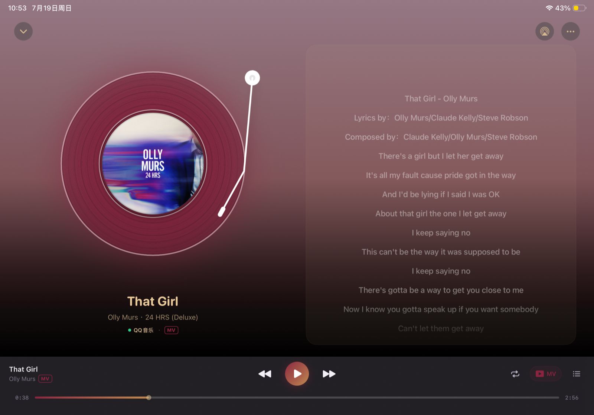
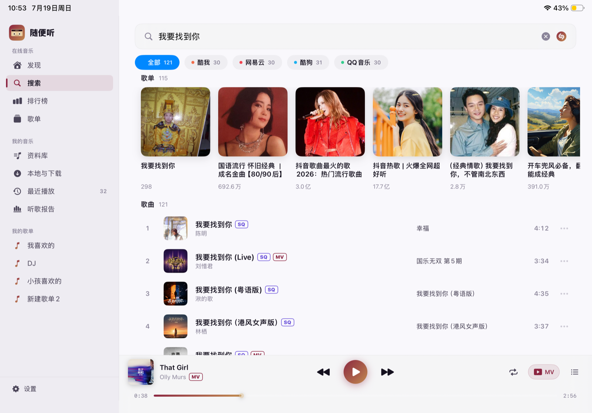
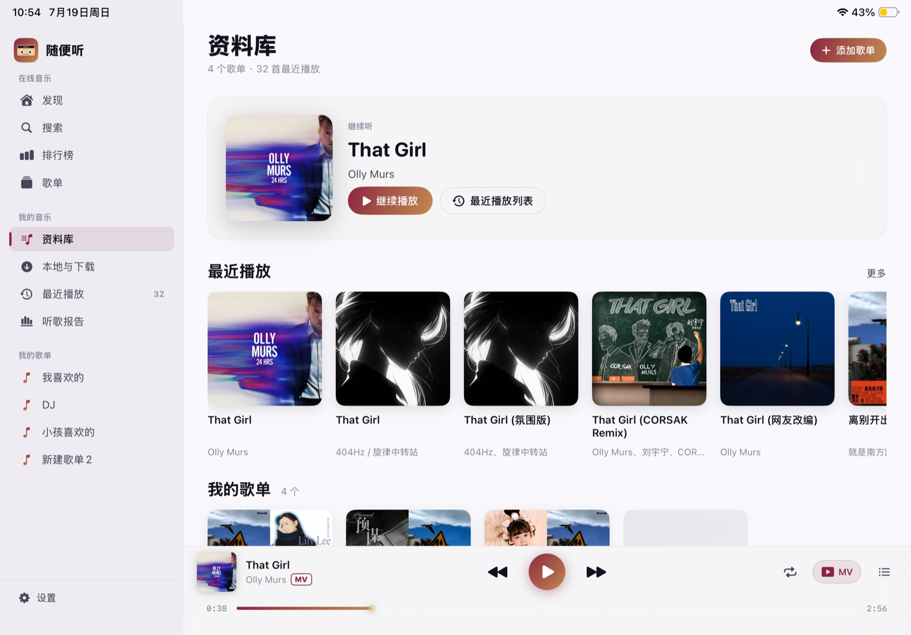
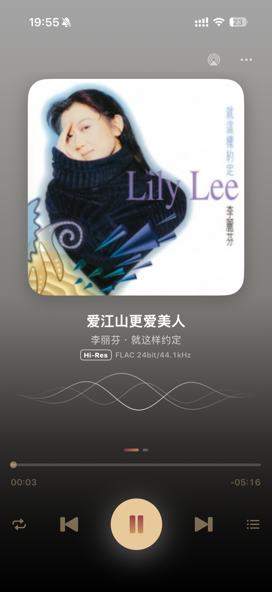

# 随便听 · walkman

> 一款 **原生 SwiftUI 三端音乐播放器**（iPhone / iPad / Mac），使用 **Swift 6 + SwiftUI + JavaScriptCore** 编写，**安装后需先在设置页面配置自定义音源**，否则播放不了音乐。

<p>
  
  
  
  
</p>

[lx-music-mobile](https://github.com/lyswhut/lx-music-mobile)（洛雪音乐）的 iOS 生态复刻与再设计：保留 **lx-music v4 自定义源 JS 解析协议**，聚合 **酷我 / 网易云 / 酷狗 / QQ 音乐** 四平台的搜索、排行榜与歌单，扩展到 **8 级音质**（最高臻品母带），并深度接入苹果生态 —— Siri 点歌、ShazamKit 听歌识曲、AirPlay、iCloud 同步、锁屏/控制中心控件、Mac 状态栏播控。

> 🤖 本项目的**全部代码均由 [Claude Code](https://claude.com/claude-code) 生成**（含架构、UI、播放/下载/导入逻辑与本文档）。

---

## 📱 界面预览



| iPad · 发现页：轮播 + 四平台推荐流 | iPad · 聚合搜索：歌单 + 歌曲、音质/MV 角标 |
|:--:|:--:|
|  |  |

| iPad · 资料库：继续听 + 最近播放 + 我的歌单 | |
|:--:|:--:|
|  | |

| iPhone · 播放页（Hi-Res 规格实测标注） | 封面取色的动态背景 | 歌单广场 | 歌单详情 |
|:--:|:--:|:--:|:--:|
|  |  |  |  |

---

## 📥 安装

本项目不上架 App Store，需自行构建或使用 DMG 包：

- **Mac**：直接安装 DMG（`bash dmg/build-dmg.sh` 自行打包，或使用他人分发的包）。未做公证，首次打开需在「系统设置 → 隐私与安全性」手动放行。
- **iPhone / iPad**：用 Xcode 打开 `walkman.xcodeproj`，改成自己的开发者签名后安装到设备（免费 Apple ID 亦可，7 天需重签）。

安装后第一件事：**设置 → 自定义音源**，通过 URL / 粘贴脚本 / 选择文件导入 lx-music v4 兼容脚本（App 不内置任何音源）。

---

## ✨ 功能特性

| 分区 | 说明 |
|---|---|
| **发现（首页）** | 轮播推荐位 + 四平台推荐歌单/排行榜聚合流（带缓存，秒开） |
| **搜索** | 四平台聚合搜歌（全部 tab 汇总 + 单平台筛选），支持歌词搜索、搜索历史；结果带音质（SQ/Hi-Res）与 MV 角标 |
| **排行榜** | 各平台官方榜单浏览 → 榜内歌曲 → 播放 / 下载 / 收藏 |
| **歌单广场** | 按平台浏览推荐歌单（最热/最新排序 + 各平台专属标签筛选），歌单关键字搜索 |
| **在线歌单导入** | 粘贴 **酷我 / 酷狗 / QQ / 网易云** 歌单分享链接（含微信分享新格式）一键**全量导入**——网易云走两步接口拿全曲目，千首大歌单分批写入不卡顿 |
| **资料库** | 继续听、最近播放、我的歌单、听歌报告（播放统计）；歌单 iCloud 多端同步 |
| **下载** | 多音质下载，按 `歌手/专辑/曲目` 目录整理，内嵌完整元数据（标题/歌手/专辑/封面/歌词）；Mac 下载到 `~/Music/Walkman` |
| **本地导入** | 选择文件夹递归扫描导入本地音乐，自动读取内嵌标签 |
| **播放页** | 封面取色动态背景、黑胶唱盘 + 唱臂（iPad）、实时音浪、滚动歌词、**实测音频规格标注**（如 `FLAC 24bit/44.1kHz`，探测自真实流而非接口宣称） |
| **播放能力** | 10 段 EQ 均衡器、AirPlay、睡眠定时、后台播放、锁屏/控制中心/CarPlay 控件、MV 播放 |
| **系统集成** | Siri / App Shortcuts（"用随便听播放晴天"）、ShazamKit 听歌识曲 |
| **Mac 专属** | 状态栏 Now Playing（歌名-歌手滚动 + 播控 + 应用内音量）、Dock 右键播控菜单、关窗不退出、DMG 分发 |
| **设置 / 自定义源** | 音质偏好、内置直连兜底开关，URL / 粘贴 / 文件三种方式导入管理 lx-music v4 脚本 |

---

## 🎵 支持的音乐平台

| 平台 | 代码 | 搜索 | 排行榜 | 歌单 | 在线歌单导入 |
|---|---|:--:|:--:|:--:|:--:|
| 酷我音乐 | `kw` | ✅ | ✅ | ✅ | ✅ |
| 酷狗音乐 | `kg` | ✅ | ✅ | ✅ | ✅ |
| QQ 音乐 | `tx` | ✅ | ✅ | ✅ | ✅ |
| 网易云音乐 | `wy` | ✅ | ✅ | ✅ | ✅ |
| 本地文件 | `local` | — | — | — | （本地导入） |

> 目录数据（搜索 / 排行榜 / 歌单）走各平台直连 API，由 App 原生实现——浏览体验不依赖脚本质量；播放地址解析优先走自定义源脚本，失败时回落到内置直连（kw / wy）兜底，单曲失败还会**跨平台搜同名歌自动换源**。

---

## 🎧 音质档位

8 级音质体系，从高到低排序，播放/下载按「目标音质 → 逐级降级」级联选取：

| 档位 | key | 显示名 | 角标 |
|---|---|---|---|
| 母带 | `master` | 臻品母带 | Master |
| 全景声 2.0 | `atmos_plus` | 臻品全景声 2.0 | Atmos |
| 全景声 | `atmos` | 臻品全景声 | Atmos |
| 高解析 | `hires` | Hi-Res 高解析 | Hi-Res |
| 24bit 无损 | `flac24bit` | Hi-Res 24bit | Hi-Res |
| 无损 | `flac` | 无损 FLAC | SQ |
| 高品 | `320k` | 高品 320k | HQ |
| 标准 | `128k` | 标准 128k | —（列表不显示角标） |

可靠性设计（对齐真实音源的各种"不老实"）：

- **脚本声明即可尝试**：无损及以上档位不要求平台元数据先上报，脚本说有就试；
- **URL 级降级**：音源拼出的高音质地址 404/403 时自动降一档重试，每档只试一次，成功档位同曲复用；
- **解码兜底**：AVFoundation 拒收的 Hi-Res FLAC 自动切内置 **libFLAC 解码器**再试，仍失败才降档。

---

## 🎨 设计风格

- **品牌色**：酒红 `#8B2440` → 古铜金 `#C18A4F` 渐变（主按钮 / 进度条 / 选中态），磁带米黄 `#E8C99A` 呼应 "Walkman" 拟物元素；明暗双外观自适应。
- **播放页封面驱动**：背景从封面取色渐变，配黑胶唱盘 + 唱臂（iPad）、实时音浪、逐行滚动歌词；音质规格（`FLAC 24bit/44.1kHz`）实测标注。
- **平台辨识色**：酷我橙 / 酷狗蓝 / QQ 绿 / 网易红，用于 chip、卡片投影与占位图；音质角标同样有专属色阶（母带赤铜 / 全景声蓝 / Hi-Res 金 / 无损紫 / HQ 青绿）。
- **三端各自原生**：iPhone 底部 tab、iPad 侧栏 + 底部播放条、Mac 状态栏/Dock/多窗口——不是一套布局拉伸三端。
- 统一设计 token（`DesignSystem.swift`）：32pt Heavy Rounded 大标题、8/12/18/28 四级圆角、系统化间距与阴影。

---

## 🧩 自定义源（基于洛雪音乐 lx-music 协议）

本项目保留并复刻了 **lx-music v4 用户脚本协议**，可直接加载社区常见的自定义源脚本：

- `JSRuntime.swift` 在 **JavaScriptCore** 上下文运行脚本，复刻预加载契约（`lx_setup` / `__lx_native__` / `__lx_native_call__*`），预加载脚本为 `Resources/user-api-preload.js`；
- 脚本发起的 HTTP 请求由 host 的 **URLSession** 代理执行（脚本本身无网络权限），对齐 lx-music-mobile 的 UA / 编码规则；
- 加解密（AES / RSA / MD5 / Base64）由 host 注入的 `CryptoBridge` 提供；
- 脚本只负责 **musicUrl / lyric / pic** 三个动作，搜索/排行榜/歌单全部为平台直连；
- `SourceManager` 负责脚本加载、能力协商（各平台支持的档位）、音质级联与跨平台换源。

导入方式：设置页粘贴脚本 URL / 直接粘贴脚本内容 / 选择 `.js` 文件。

---

## 🛠 技术栈

- **Swift 6** + **SwiftUI**（`-default-isolation=MainActor` 全局主隔离，数据/解析类型显式 `nonisolated + Sendable`）
- **AVFoundation**（AVPlayer + MTAudioProcessingTap 实现 EQ/音浪）+ 内置 **libFLAC** Hi-Res 解码兜底
- **JavaScriptCore**（运行 lx v4 自定义源脚本）
- **ShazamKit**（听歌识曲）、**App Intents / SiriKit**（Siri 点歌与快捷指令）
- **Combine + ObservableObject** 状态管理；JSON 文件 + iCloud KVS（`NSUbiquitousKeyValueStore`）持久化/同步
- **Mac Catalyst**（Mac 版与 iPad 共享代码，AppKit 能力运行时桥接）

---

## 📦 项目结构

```
walkman/
├── walkmanApp.swift / RootTabView        应用入口 + iPhone 布局
├── iPad/                                 iPad 布局（侧栏 / 底栏 / 黑胶播放页…）
├── Mac/                                  Mac 状态栏、窗口控制（运行时 AppKit 桥接）
├── PlaybackEngine / HiResFLACPlayer      播放内核 + 音质降级链 + libFLAC 兜底
├── EQAudioTap / Equalizer                10 段 EQ（MTAudioProcessingTap）
├── JSRuntime / SourceManager             lx v4 脚本运行时 + 能力协商/选档/换源
├── Catalogs / Songlists / Boards         四平台直连：搜索 / 歌单 / 排行榜
├── SonglistImporter                      在线歌单链接解析与全量导入
├── Stores / CloudSync                    歌单/脚本/设置持久化 + iCloud 同步
├── DownloadStore / AudioMetadataWriter   下载管理 + 元数据嵌入
├── Lyrics / MvResolver / SongRecognizer  歌词 / MV / 听歌识曲
└── Resources/user-api-preload.js         lx 协议预加载脚本（不可删改）
docs/          功能规格与截图
dmg/           Mac DMG 打包脚本与素材
scripts/       历史下载迁移脚本（仅 Mac）
```

---

## 🚀 构建与运行

环境：**Xcode 26**（iOS 26 SDK）。工程使用 Xcode 16+ 的同步文件夹（`PBXFileSystemSynchronizedRootGroup`），增删文件无需手改 pbxproj。

### 1. 换成你自己的签名团队（真机 / Mac 必需，模拟器可跳过）

工程里预置的 `DEVELOPMENT_TEAM` 是原作者的，你**没有**该团队的账号，直接编译会报 `No account for team ...`。在 Xcode 里打开 **Signing & Capabilities**，勾选 Automatically manage signing，把 Team 换成你自己的 Apple ID 即可（免费账号也行，7 天需重签）。四个 target（app / Widget / Tests / UITests）各改一次。

### 2. 改成你自己的 Bundle ID

工程里的 `com.heartbeat.walkman` 系列 ID 绑定在原作者账号下，**你必须换成自己的**，否则签名会失败。在 Xcode 里对四个 target 各改一次（app / Widget / Tests / UITests），或全局替换 `com.heartbeat.walkman` 为你的前缀。同时 `walkman/walkman.entitlements` 与 `WalkmanWidgetExtension.entitlements` 里的 App Group `group.com.heartbeat.walkman` 也要一并改（Widget 与主 App 靠它共享数据）。

### 3. 按需开关 Capability

免费开发者账号拿不到部分能力，遇到签名报错时可在 Signing & Capabilities 里删掉对应项再编译，功能会相应失效但不影响主体：

| Capability | 作用 | 去掉的后果 |
|---|---|---|
| iCloud (Key-Value storage) | 歌单/脚本多端同步 | 仅本地保存 |
| App Groups | Widget 与主 App 共享数据 | Widget 不显示内容 |
| Siri | 语音点歌、快捷指令 | Siri 相关功能失效 |
| Push Notifications | 预留 | 无影响 |

### 4. 编译

```bash
# iOS 模拟器
xcodebuild -project walkman.xcodeproj -scheme walkman \
  -destination 'platform=iOS Simulator,name=iPhone 17 Pro' build

# Mac (Catalyst)
xcodebuild -project walkman.xcodeproj -scheme walkman \
  -destination 'platform=macOS,variant=Mac Catalyst' build
```

> 提示：改过签名设置后 `project.pbxproj` 会带上你自己的 Team ID 和 Bundle ID。如果打算提 PR，记得把这些本地改动排除掉，别混进提交里。

Mac DMG 打包：

```bash
bash dmg/build-dmg.sh
```

> 脚本优先使用放在 `build/dmg/walkman.app` 的 Developer ID 签名版，否则本地 Release 编译兜底；DMG 背景图与图标由 `dmg/make-background.swift`、`dmg/make-icns.swift` 生成。

历史下载文件如需迁移到 `歌手/专辑/曲目` 新目录规则：运行 `scripts/migrate-downloads.swift`（仅 Mac 需要，iPhone/iPad 不涉及）。

---

## 📌 致谢与声明

- 自定义源协议与预加载脚本来自 **[洛雪音乐 lx-music](https://github.com/lyswhut/lx-music-mobile)**，感谢其生态与社区脚本。本项目仅复刻其脚本运行契约以兼容现有自定义源，并未内置任何音源。
- 本项目为**学习与个人使用**目的的开源播放器，不提供、不内置任何版权音频资源；所有内容均由用户自行导入的自定义源或公开接口提供。请在所在地法律允许的范围内使用，支持正版音乐。
- 与上述任何音乐平台、洛雪音乐项目均无隶属或合作关系。

## 📄 License

本项目采用 [Apache License 2.0](LICENSE)。

### 第三方组件

| 组件 | 用途 | 许可 |
|---|---|---|
| [libFLAC](https://xiph.org/flac/) (Xiph.Org) | Hi-Res FLAC 解码兜底，位于 `walkman/Frameworks/libflac/` | [BSD 3-Clause](walkman/Frameworks/libflac/COPYING.Xiph) |
| [lx-music](https://github.com/lyswhut/lx-music-mobile) 用户脚本协议 | `walkman/Resources/user-api-preload.js` 复刻其 v4 脚本契约 | Apache-2.0 |

仅内置 BSD 许可的 libFLAC 解码库，**不包含** GPL 许可的 FLAC 命令行工具。完整声明见 [NOTICE](NOTICE)。
